# Splitting into Fully Independent Domain Indexers

## Design Principles

1. **Complete independence** -- each indexer has its own database, processor, schema, and API.
2. **No shared entities** -- `Account` FK relations become plain address strings (`owner: String!` instead of `owner: Account!`).
3. **No Transfer enrichment** -- the shared `saveTransfer` pattern is eliminated. Each domain creates its own transfer/deposit/withdrawal records using data from its own events (amounts, addresses are already available in domain events).
4. **Duplicated infrastructure where needed** -- Router events, template management, and Settings fields are subscribed to locally by each indexer that needs them, rather than being a shared dependency.

## Current Coupling and How to Break It

| Coupling point | Current design | New design |
|---|---|---|
| `Account` entity | FK relations from Worker, Delegation, Gateway, etc. | Plain `owner: String!` address fields |
| `saveTransfer()` | Domain handlers enrich a shared Transfer record | Token indexer subscribes to all domain events via templates, enriches Transfer with `type` + plain string IDs (`workerId`, `delegationId`, etc.) instead of FK relations. Domain indexers no longer write transfer records. |
| `realOwner` / `unwrapAccount` | Walks `Account.owner` chain for vesting | **Dropped entirely** -- `realOwner` was legacy. Only `owner` (direct address) is kept. |
| `Settings` singleton | Shared entity written by Router/NC handlers | Each indexer subscribes to Router + NetworkController events to maintain its own local settings |
| `ctx.templates` | Populated from Router events in a single process | Each indexer subscribes to Router `*Set` events and manages its own templates |
| `Block` / `Epoch` | Shared entities used by rewards/metrics | Each indexer that needs them tracks blocks/epochs independently |
| `claimableDelegationCount` on Account | Updated by rewards + staking handlers | Moved to a `Delegator` entity in the workers indexer |

## Proposed Indexers

```mermaid
flowchart TD
    subgraph token ["Token Indexer"]
        direction TB
        T_SQD["SQD Transfer events"]
        T_Domain["Domain events via templates for type classification"]
        T_Ent["Account, Transfer with type + string IDs, AccountTransfer"]
    end

    subgraph workers ["Workers Indexer"]
        direction TB
        W_Reg["WorkerRegistration events"]
        W_Stk["Staking events"]
        W_Rew["RewardsDistribution events"]
        W_RT["RewardTreasury events"]
        W_Router["Router + NC events (local)"]
        W_Vest["VestingCreated (local lookup)"]
        W_Ent["Worker, Delegation, Reward, Commitment, ..."]
    end

    subgraph gateways ["Gateways Indexer"]
        direction TB
        G_GW["GatewayRegistry events"]
        G_PP["PortalPool events"]
        G_Router["Router events (local)"]
        G_Vest["VestingCreated (local lookup)"]
        G_Ent["Gateway, GatewayStake, PortalPool, ..."]
    end

    subgraph accounts ["Accounts Indexer"]
        direction TB
        A_Vest["VestingFactory + Vesting events"]
        A_TH["TemporaryHolding events"]
        A_SQD["SQD Transfer (for releases)"]
        A_Ent["Vesting, TemporaryHolding"]
    end

    Portal[Portal / RPC] --> token
    Portal --> workers
    Portal --> gateways
    Portal --> accounts

    token --> DB_T[(Token DB)]
    workers --> DB_W[(Workers DB)]
    gateways --> DB_G[(Gateways DB)]
    accounts --> DB_A[(Accounts DB)]
```



---

### Indexer 1: Token

**Purpose:** SQD token transfers, account balances, balance history, and transfer type classification.

**Events subscribed:**
- SQD `Transfer` (core event)
- Router: all `*Set` events (to maintain templates for staking, worker registration, reward treasury, network controller)
- WorkerRegistration (template): `WorkerRegistered`, `WorkerWithdrawn`, `ExcessiveBondReturned` -- to tag transfers as DEPOSIT/WITHDRAW
- Staking (template): `Deposited`, `Withdrawn`, `Claimed` -- to tag transfers as DEPOSIT/WITHDRAW/CLAIM
- GatewayRegistry: `Staked`, `Unstaked` -- to tag transfers as DEPOSIT/WITHDRAW
- RewardsDistribution: `Claimed` -- to tag as CLAIM
- RewardTreasury (template): `Claimed` -- to tag as CLAIM
- VestingFactory: `VestingCreated` + Vesting template: `ERC20Released` -- to tag as RELEASE
- PortalPoolFactory: `PoolCreated` + PortalPool template: `Deposited`, `Withdrawn`, `ExitClaimed` -- to tag as DEPOSIT/WITHDRAW

This is the same `findTransfer` + `saveTransfer` pattern as today, but the enrichment writes `type` + plain string IDs instead of entity FK relations.

**Entities:**

```graphql
type Account @entity {
  id: ID!                # address
  type: AccountType!     # USER, VESTING, TEMPORARY_HOLDING
  balance: BigInt!
  owner: Account         # beneficiary for vesting/temp holding accounts
}

type Transfer @entity {
  id: ID!
  blockNumber: Int!
  timestamp: DateTime!
  txHash: String!
  type: TransferType!    # TRANSFER, DEPOSIT, WITHDRAW, CLAIM, RELEASE
  from: Account!
  to: Account!
  amount: BigInt!
  workerId: String       # plain string, was Worker FK
  delegationId: String   # plain string, was Delegation FK
  gatewayStakeId: String # plain string, was GatewayStake FK
  vestingId: String      # plain string, was Account FK (vesting address)
  portalPoolId: String   # plain string, was PortalPool FK
}

type AccountTransfer @entity {
  id: ID!
  direction: TransferDirection!
  account: Account!
  transfer: Transfer!
  balance: BigInt!
}
```

**What changes vs. today:**
- `Transfer.worker`, `.delegation`, `.gatewayStake`, `.vesting`, `.portalPool` FK relations become plain `String` ID fields (`workerId`, `delegationId`, etc.)
- `Transfer.type` enum is **preserved** (TRANSFER, DEPOSIT, WITHDRAW, CLAIM, RELEASE)
- `Account` keeps `type` and `owner` (needed for vesting/temp holding classification) but drops `claimableDelegationCount` and all `@derivedFrom` collections for workers/delegations/gateways
- VestingFactory and TemporaryHoldingFactory events are subscribed to maintain `Account.type` and `Account.owner`

**Server extension resolvers (migrated from current):**
- `accountBalanceTimeseries` -- works unchanged (only uses Transfer + AccountTransfer)
- `lockedValueTimeseries` -- works unchanged, filters on `worker_id IS NOT NULL`, `delegation_id IS NOT NULL`, etc. (same column names, just no FK constraint)
- `mv_holders_count_daily`, `mv_unique_accounts_daily`, `mv_transfers_by_type_daily`, `mv_locked_value_daily`

---

### Indexer 2: Workers and Staking

**Purpose:** Worker lifecycle, delegations, rewards distribution, APR calculations, and worker metrics.

**Events subscribed:**
- Router: `WorkerRegistrationSet`, `StakingSet`, `NetworkControllerSet`, `RewardTreasurySet`, `RewardCalculationSet` (to maintain local templates + settings)
- NetworkController: `BondAmountUpdated`, `EpochLengthUpdated`, `LockPeriodUpdated`
- WorkerRegistration: `WorkerRegistered`, `WorkerDeregistered`, `WorkerWithdrawn`, `MetadataUpdated`, `ExcessiveBondReturned`
- Staking: `Deposited`, `Withdrawn`, `Claimed`
- RewardsDistribution: `Distributed`, `Claimed`
- RewardTreasury: `Claimed`
- SQD Token: `Transfer` (needed for `findTransfer` matching in Registered/Withdrawn/ExcessiveBondReturned handlers -- to extract bond amounts from token transfer logs in the same block)

**Entities (Account FK -> string):**

```graphql
type Worker @entity {
  id: ID!
  peerId: String!
  owner: String!       # plain address string
  bond: BigInt!
  # ... same fields as today, minus realOwner
}

type Delegation @entity {
  id: ID!
  owner: String!       # plain address string
  worker: Worker!
  deposit: BigInt!
  # ... same fields, minus realOwner
}

type Delegator @entity {
  id: ID!              # address
  claimableDelegationCount: Int!
}
```

- `Worker.owner` / `Delegation.owner` become plain address strings
- `realOwner` is **dropped** (was legacy)
- NEW `Delegator` entity replaces `Account.claimableDelegationCount`
- `WorkerReward`, `DelegationReward`, `Commitment` -- unchanged (no Account FKs)
- `WorkerSnapshot`, `WorkerMetrics` -- unchanged
- Local `Settings` entity for bond amount, epoch length, lock period, base APR, utilized stake
- Local `Block` entity for L1 block number mapping (needed by `Distributed` handler)
- Local `Epoch` entity

**No domain-specific transfer entities needed:**
Transfer records (with type + string IDs) are handled entirely by the Token indexer. The Workers indexer does not create transfer records. Instead:
- `worker/Registered.handler.ts` uses `findTransfer` to extract the bond amount from the SQD Transfer log, then stores it directly on `Worker.bond` -- no `saveTransfer` call.
- `staking/Deposited.handler.ts` reads the deposit amount from the event args or matched SQD Transfer, stores it on `Delegation.deposit`.
- All transfer querying (deposits/withdrawals for a worker or delegation) happens via the Token indexer API, filtering by `workerId`/`delegationId` string fields.

**Head-only jobs (remain here):**
- `updateWorkersOnline` -- polls NETWORK_STATS_URL
- `updateWorkersMetrics` -- polls NETWORK_STATS_URL
- `updateWorkerRewardStats` -- polls REWARDS_MONITOR_API_URL
- `updateWorkersCap` -- multicall to SoftCap contract
- `recalculateWorkerAprs` -- local computation

**Materialized views (migrated):**
- `mv_active_workers_daily`, `mv_delegations_daily`, `mv_delegators_daily`, `mv_reward_daily`, `mv_apr_daily`, `mv_uptime_daily`, `mv_queries_daily`, `mv_served_data_daily`, `mv_stored_data_daily`

---

### Indexer 3: Gateways

**Purpose:** Gateway registration, staking, and portal pools.

**Events subscribed:**
- Router: `WorkerRegistrationSet` (not needed), only the subset needed -- actually just needs to maintain its own gateway-related state
- GatewayRegistry: `Registered`, `Unregistered`, `Staked`, `Unstaked`, `MetadataChanged`, `AutoextensionEnabled`, `AutoextensionDisabled`
- PortalPoolFactory: `PoolCreated`
- PortalPool template: `Deposited`, `Withdrawn`, `ExitClaimed`
- SQD Token: `Transfer` (for matching stake/unstake amounts via `findTransfer`)

**Entities:**

```graphql
type Gateway @entity {
  id: ID!
  createdAt: DateTime!
  owner: String!        # plain address string, realOwner dropped
  stake: GatewayStake!
  status: GatewayStatus!
  name: String
  website: String
  # ...
}

type GatewayStake @entity {
  id: ID!
  owner: String!        # plain address string, realOwner dropped
  amount: BigInt!
  locked: Boolean!
  # ...
}

type PortalPool @entity {
  id: ID!
  operator: String!     # was Account FK
  # ...
}

```

**No domain-specific transfer entities needed:**
Transfer records (with type + `gatewayStakeId`/`portalPoolId` string fields) are handled by the Token indexer. The Gateways indexer stores amounts directly on `GatewayStake.amount` and `PortalPool` fields.

**Note:** The `Staked` handler currently checks `await ctx.store.get(PortalPool, operatorId)` to skip if the operator is a portal pool. Since PortalPool is in this same indexer, this continues to work as-is.

---

### Indexer 4: Accounts (Vesting + Temporary Holdings)

**Purpose:** Vesting contract lifecycle and temporary holding contracts.

**Events subscribed:**
- VestingFactory: `VestingCreated`
- Vesting template: `OwnershipTransferred` (tethys only)
- TemporaryHoldingFactory: `TemporaryHoldingCreated`

(No SQD Transfer subscription needed -- vesting release transfers are tracked by the Token indexer with `type: RELEASE` and `vestingId` string field.)

**Entities:**

```graphql
type Vesting @entity {
  id: ID!              # vesting contract address
  beneficiary: String! # beneficiary address
  createdAt: DateTime!
}

type TemporaryHolding @entity {
  id: ID!
  address: String!     # holding contract address
  beneficiary: String!
  admin: String!
  unlockedAt: DateTime!
  locked: Boolean!
}
```

This is the lightest indexer -- minimal state, minimal events.

**No domain-specific transfer entities needed:**
Transfer records (with `type: RELEASE` and `vestingId` string field) are handled by the Token indexer.

---

## Monorepo Structure (pnpm workspaces)

```
pnpm-workspace.yaml          # packages: ['packages/*']
package.json                  # root: private, scripts for build/lint
.npmrc                        # shamefully-hoist=true (needed for typeorm decorators)
biome.json                    # shared lint config (kept at root)
packages/
  shared/                     # @sqd/shared
    package.json
    tsconfig.json
    src/
      abi/                    # All ABI bindings (moved from src/abi/)
      config/
        network.ts            # NETWORK env, contract addresses, types
        rpc-client.ts         # RPC_ENDPOINT client
      utils/
        misc.ts               # parsePeerId, parseWorkerMetadata, normalizeAddress, etc.
        time.ts               # time constants and helpers
        queue.ts              # Task type
        events.ts             # EventEmitter (if still needed)
      item.ts                 # Item types, isContract, isLog, sortItems
      base.ts                 # createHandler, createHandlerOld, timed
      helpers/
        ids.ts                # ID creation helpers (createWorkerId, etc.)
        misc.ts               # findTransfer, findTransferInTx
  token/                      # @sqd/token
    package.json              # depends on @sqd/shared (workspace:*)
    tsconfig.json
    schema.graphql
    commands.json
    db/migrations/
    src/
      main.ts
      config/processor.ts
      handlers/
      model/                  # generated from schema.graphql
      server-extension/
  workers/                    # @sqd/workers
    package.json
    tsconfig.json
    schema.graphql
    commands.json
    db/migrations/
    src/
      main.ts
      config/processor.ts
      handlers/
      model/
      server-extension/
  gateways/                   # @sqd/gateways
    package.json
    tsconfig.json
    schema.graphql
    commands.json
    db/migrations/
    src/
      main.ts
      config/processor.ts
      handlers/
      model/
      server-extension/
  accounts/                   # @sqd/accounts
    package.json
    tsconfig.json
    schema.graphql
    commands.json
    db/migrations/
    src/
      main.ts
      config/processor.ts
      handlers/
      model/
      server-extension/
```

Each indexer package has its own `schema.graphql` -> `squid-typeorm-codegen` -> `src/model/generated/`, its own migrations, and its own `main.ts` entry point. They all depend on `@sqd/shared` via `workspace:*`.

## Migration Approach

**Phase 1: Scaffold monorepo + shared package** -- Convert to pnpm workspaces. Create `pnpm-workspace.yaml`, root `package.json`, `.npmrc`. Move ABIs, network config, RPC client, utilities, item helpers, and handler base into `packages/shared` as a buildable TypeScript library. Verify existing code still compiles (the old `src/` can temporarily remain alongside as a reference).

**Phase 2: Build domain indexers one at a time** -- Start with the simplest (Accounts), then Gateways, then Token, then Workers (most complex). Each new indexer:
- Gets its own `schema.graphql` with string-typed address fields
- Gets its own processor config subscribing only to its events
- Gets its own `main.ts` with only its domain's init/queue/complete logic
- Handlers are adapted: remove `saveTransfer` calls, create domain-specific transfer records instead
- `realOwner` logic uses a local vesting lookup instead of `unwrapAccount(account)`

**Phase 3: Migrate server extensions** -- Split the current resolvers and materialized views across the domain-specific APIs. The `lockedValueTimeseries` resolver currently queries the `transfer` table with `worker_id IS NOT NULL` etc. -- this becomes separate queries against each indexer's own transfer tables, or each indexer exposes its own locked-value endpoint.

**Phase 4: Deploy and decommission** -- Deploy all 4 indexers. The frontend/API gateway queries each indexer independently or via GraphQL federation. Decommission the monolith.

## Risks and Mitigations

- **Data duplication**: VestingCreated events are consumed by 2 indexers (Token for Account.type/owner, Accounts for Vesting entity). This is intentional and lightweight -- only a handful of events.
- **Router event duplication**: Workers indexer needs Router events for templates. This is a small number of events total (contract address changes are rare).
- **Token indexer subscribes to domain events**: The Token indexer subscribes to all domain contract events (via templates) to classify transfer types. This makes it heavier than a pure token indexer, but it is the single source of truth for all SQD movements and their categorization. The domain handlers in the Token indexer only write `type` + string ID fields on Transfer -- they do not create domain entities.
- **SQD Transfer subscription in domain indexers**: Workers and Gateways indexers still subscribe to SQD Transfer to match bond/stake amounts via `findTransfer` (amounts are not always directly available in domain event args). The Accounts indexer does not need SQD Transfer subscription.
- **realOwner dropped**: Frontends that previously queried by `realOwner` (to show vesting-owned workers for the beneficiary) will need to resolve vesting ownership through the Accounts indexer and then query the Workers/Gateways indexers by the vesting contract address as `owner`.
- **No cross-indexer joins**: A frontend query like "show me all workers + delegations + gateways for address X" now requires 2 API calls (Workers + Gateways). This is acceptable for domain-specific UIs and can be handled by a thin aggregation layer or BFF.
- **Consistency**: Indexers sync independently at different speeds. A worker may appear in the Workers indexer before its owner account appears in the Token indexer. This is acceptable since there are no foreign keys between databases.
